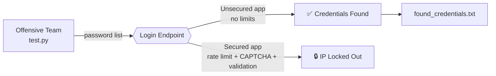

Readme · MD
<div align="center">
# 🛡️ FortiLogin
### Brute-Force Attack & Defense Lab
 
*A Red Team vs. Blue Team demonstration of a credential brute-force attack against a vulnerable login system — and a hardened counterpart engineered to withstand it.*
 


 
[Live Unsecured Demo](https://twosaunsecured.onrender.com/login) · [Live Secured Demo](https://twosasecured-1.onrender.com/login) · [Report a bug](../../issues)
 
</div>
---
 
> **Suggested repo name:** `FortiLogin-BruteForce-Lab`
> Other options: `LoginSiege` · `CredCrackLab` · `BruteWall`
 
## 📑 Table of Contents
 
- [Overview](#-overview)
- [How the Attack Works](#%EF%B8%8F-how-the-attack-works)
- [How the Defense Works](#-how-the-defense-works)
- [Architecture](#-architecture)
- [Project Structure](#%EF%B8%8F-project-structure)
- [Getting Started](#-getting-started)
- [Tech Stack](#-tech-stack)
- [Team](#-team)
- [Ethical Use Disclaimer](#%EF%B8%8F-ethical-use-disclaimer)
- [License](#-license)
---
 
## 📖 Overview
 
This project is a hands-on cybersecurity exercise comparing **two identical Flask login applications**:
 
<div align="center">
| | 🔓 Unsecured Target | 🔒 Secured Target |
|---|---|---|
| **Purpose** | Deliberately vulnerable login for offensive testing | Hardened login demonstrating real-world defenses |
| **Live demo** | [twosaunsecured.onrender.com/login](https://twosaunsecured.onrender.com/login) | [twosasecured-1.onrender.com/login](https://twosasecured-1.onrender.com/login) |
| **Outcome** | ❌ Brute-forced successfully with a password-list attack | ✅ Attack blocked by rate limiting, lockout & CAPTCHA |
 
</div>
An **Offensive Team** built and ran a Python brute-force script against the unsecured target, while a **Defensive Team** engineered mitigations into the secured version. Full methodology and findings are written up in `Cybersecurity Project Report.docx`.
 
---
 
## ⚔️ How the Attack Works
 
`BruteForce Project/test.py` is a password-list (dictionary) attack script:
 
- 📃 Loads candidate passwords from `password.txt` (100 common/leaked passwords, e.g. `123456`, `password`, `iloveyou`)
- 🌐 Sends repeated `POST` requests to `/login` for a fixed username (`admin`)
- ✅ Detects success via a JSON `{"ok": true}` response or a `200` page containing `"Welcome"`
- 🛑 Stops immediately on the first successful match and logs it to `found_credentials.txt`
- 🧯 Includes a configurable safety cap (`MAX_TRIALS`) and a small delay between attempts
Against the **unsecured** app, this succeeds quickly because there is no attempt limiting, no CAPTCHA, and the login endpoint accepts unlimited requests.
 
## 🧱 How the Defense Works
 
`Secured/app.py` hardens the exact same login flow with layered defenses:
 
| Defense | What it does |
|---|---|
| 🚦 **IP-based rate limiting & lockout** | 5 failed attempts trigger a 15-minute lockout per IP |
| 🧩 **Per-request CAPTCHA tokens** | Server-issued, single-use, IP-bound, and time-expiring (5 min) |
| 🧼 **Input validation & sanitization** | Regex-based SQL-injection and XSS pattern detection on every field |
| ⏱️ **Constant-time credential comparison** | `secrets.compare_digest()` to prevent timing attacks |
| 🔐 **Session hardening** | Session regeneration on login (anti-fixation), `HttpOnly` + `SameSite=Lax` cookies |
| 🛡️ **Security response headers** | `X-Content-Type-Options`, `X-Frame-Options`, `X-XSS-Protection`, `Content-Security-Policy` |
 
The result: the same brute-force script that succeeds against the unsecured app gets locked out almost immediately here.
 
---
 
## 🧭 Architecture
 

 
---
 
## 🗂️ Project Structure
 
```
BruteForce/
├── BruteForce Project/
│   ├── test.py                  # Password-list brute-force attack script
│   ├── password.txt             # Wordlist used for the attack
│   └── found_credentials.txt    # Output: credentials recovered during testing
├── Unsecured/
│   ├── app.py                   # Vulnerable Flask login app
│   ├── requirements.txt
│   └── procfile                 # Render/Heroku process file
├── Secured/
│   ├── app.py                   # Hardened Flask login app
│   ├── requirements.txt
│   └── procfile
├── Cybersecurity Project Report.docx   # Full writeup: methodology, findings, mitigations
├── Teams.txt                     # Offensive Team / Defensive Team roster
└── URLS.txt                      # Deployed demo links
```
 
> ⚠️ **Note:** Both Flask apps call `render_template()` for `login.html` / `success.html`, but a `templates/` folder isn't currently in the repo — add one with those two templates before running either app locally.
 
---
 
## 🚀 Getting Started
 
### Prerequisites
- Python 3.9+
- `pip`
### 1️⃣ Run the vulnerable app locally
```bash
cd Unsecured
pip install -r requirements.txt
python app.py       # http://localhost:5000
```
 
### 2️⃣ Run the secured app locally
```bash
cd Secured
pip install -r requirements.txt
python app.py       # http://127.0.0.1:5000
```
 
### 3️⃣ Run the attack script
```bash
cd "BruteForce Project"
pip install requests
python test.py
```
By default `test.py` targets the **deployed** unsecured demo (`TARGET_URL`). Change this constant to `http://localhost:5000/login` to test locally instead.
 
🔑 Default demo credentials (both apps): `admin` / `cyber123`
 
---
 
## ⚠️ Ethical Use Disclaimer
 
This repository is for **educational and authorized security-testing purposes only**. Both target applications use hardcoded demo credentials and are intended to be attacked only in this controlled lab context. Do not point the attack script at any system you do not own or have explicit written permission to test — unauthorized access attempts are illegal in most jurisdictions.
 
---
 
## 📄 License
 
<div align="center">
Released under the **MIT License** — swap this section for whichever license you prefer.
 
Made with 🧠 by the FortiLogin Red & Blue Teams
 
</div>
 
